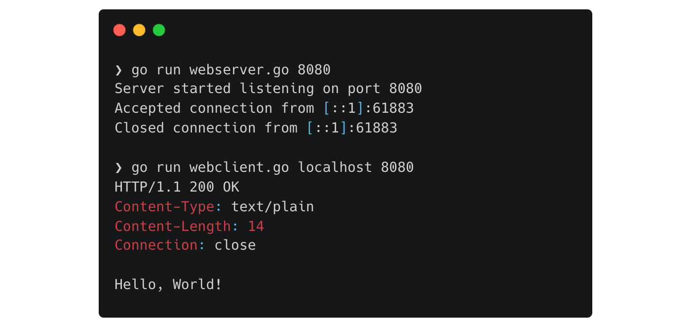

# Project 5: HTTP Client and Server

Read [the article](https://alexandear.github.io/posts/2025-12-18-beej-project-http-client-server/) for explanations.



## Client

```sh
# Connect to default port 80
$ go run webclient.go example.com

# Connect to port 8088
$ go run webclient.go example.com 8088
```

## Server

```sh
# Listen on port 28333
$ go run webserver.go

# Listen on port 12399
$ go run webserver.go 12399
```
