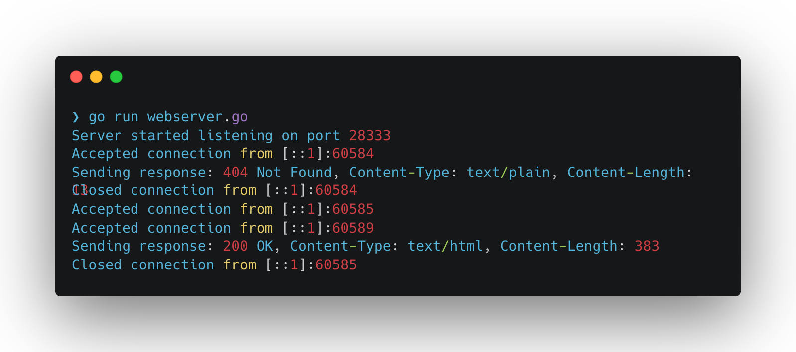

# Project 9: A Better Web Server



## Server

```sh
# Listen on port 28333
$ go run webserver.go

# Listen on port 12399
$ go run webserver.go 12399
```

### API

Server supports the following requests from a browser:

- `http://localhost:28333/file1.txt` -> 200 OK, text
- `http://localhost:28333/file2.html` -> 200 OK, html
- `http://localhost:28333/notfound.html` -> 404 Not Found, text
- `http://localhost:28333/../../notfound.html` -> 404 Not Found, text
